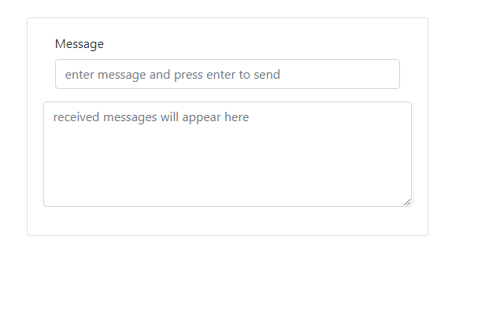

****INSTALL
- Clone or download this project [here](https://codeload.github.com/mimidotsuser/dyce.io/zip/master)
- The best (and currently only) way to install dependencies is using composer. This ensure one downloads the right version dependicies
The project depends on [ratchet](http://socketo.me) a loosely coupled PHP sockets library.
- Run `php serve.php` on command line to start server (listens at port 8000, one can change this)
- Then serve the rest of the content at a local server. Visit http://myserver/index.php to view client area.

Here is the client message View

       
   